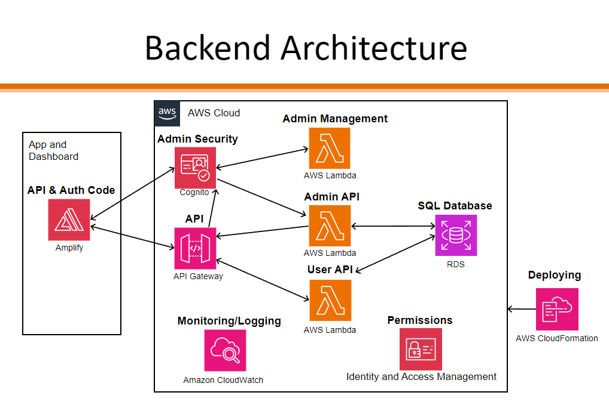

# Project Overview

Compression garments are currently the only known treatment for managing Post-Thrombotic Syndrome (PTS), which can cause chronic pain, swelling, ulcers and other symptoms. Researchers at Sick Kids want to develop strategies to increase patients' adherence to their treatment plan since garments can be uncomfortable and tedious to wear. The researchers at Sick Kids test the effectiveness of adherence strategies by measuring the difference between self-reported and actual hours of wear in studies conducted with voluntary participants.

This project is primarily a mobile app that enables research studies into patient adherence to treatment plans using compression garments. The app essentially acts as a gateway between compression garments equipped with a sensor and the research database. Its purpose will be to provide the user with basic information about their medical device, allow users to report their hours wearing the compression garments, and most importantly, collect sensor data from the device and forwarding it to the database. There is also a web application where the researchers can view and export the data into CSV format, and potentially make changes to parameters like the reading interval or questionnaire frequency.

## Key Features and their Implementation Status

* Scan, connect, and disconnect to sensor device [DONE]
    * If a device was previously connected, connection will be done automatically next time the app is opened [DONE]
    * MTU negotiated, current timestamp and reading interval written to device upon connection [DONE]
* Sensor device can be associated with a specific patient (ID) through device registration [DONE]
    * Admins have accounts and can login on the mobile app allowing them to perform registration [DONE]
        * Admin login is hidden behind some kind of secret swiping or gesture code
* Sensor reading collection from sensor device [DONE]
    * If a device was previously connected, collection will be done automatically next time the app is opened [DONE]
    * Custom [data transfer protocol](./app/ble_data_transfer_protocol.md) to ensure lossless and fast transfer [DONE]
* Sensor data caching after collection on local device [DONE]
* Sensor data uploaded to backend [DONE]
    * The raw data will be stored in the backend
* Users can see battery level, connectivity status to device and internet, and heart rate in realtime on the mobile app [DONE]
    * Notifications are sent out on low battery level
* Self-report questionnaires can be filled in the app [DONE]
    * Questionnaires are uploaded to the backend upon submission [DONE]
    * Notifications are sent out reminding users when a questionnaire is available
* Users are asked via notification if they have been wearing the compression garments or wish to withdraw from the study when they have not connected to the device in a while
* Admin can login to web app [DONE]
* Web app allows admins to invite other admins [DONE]
* Admins can view and export reading data for a specific patient or device [DONE]
* Admins can view and export self-reported hours of wear for a specific patient
* Admins can see a list of devices and patients [DONE]
    * Admins can see which patient is currently associated with a device (which patient/device is active) [DONE]
* Admins can configure reading interval and questionnaire frequency for a specific device [DONE]
* Admins are alerted when a study participant has not uploaded their readings in a while [DONE]

Definitions:
* Reading interval refers to the period that the sensor device will collect samples. It is NOT the period of how often the mobile app collects data from the sensor.

## Features to be Implemented

This list is a compiled version of whatever is not marked as DONE in the "Key Features and their Implementation Status" section with additional details.

* Admin login is hidden behind some kind of secret swiping or gesture code
    * This feature is a minor UI/UX improvement
    * You have the option to be creative with this, we recommend looking to the SettingsTab.tsx file in the mobile app and adding some logic to track user input. Based on the user input, the Login.tsx component should be displayed or hidden.
* Notifications for battery level, self-report questionnaires, and asking the user if they wish to withdraw (after prolonged activity)
    * This will be a harder task than it seems. You will first need to look into the difference between how iOS and Android handles notifications, and be prepared to make a Firebase account for Android notifications. Ignore all reference to notifications in the app, we recommend starting from scratch.
* Admins are alerted when a study participant has not uploaded their readings in a while
    * This feature could be improved to send an email to the researchers instead of only displaying a pop-up alert on the web app.
    * This feature can also be improved by sending an alert automatically once the admin logs in, instead of the admin having to click on an individual device.
* Sensor reading collection from sensor device
    * This functionality could be improved by collecting data from the sensor device even when the app is terminated, but it is very challenging to do so. Android and iOS have completely different approaches when it comes to terminated apps, and both have different kinds of workarounds. We also currently know of no good way of testing changes for this feature other than setting up some kind of logging service like Splunk. Finally, the cherry on top is that because we use react native and react-native-ble-plx, we have layers of abstraction in front of us making it hard to do the granular things on iOS and Android that need to be done in order to achieve the desired effect.

## Who are the target users?

 * High school adolescents around the Greater Toronto Area (GTA) diagnosed with Post-Traumatic Stress (PTS) who are voluntarily participating in a study on compression garment adherence strategies. Since they have PTS, they are likely motivated to help the researchers in successfully conducting their study which may result in improvements to their treatment plans. They are responsible for wearing their garments according to their treatment plan and for self-reporting estimates of their hours of wear. They are expected to have basic smartphone skills and know how to navigate basic user interfaces. They will likely have busy schedules due to schoolwork, social relationships, and other activities, which may cause them to prioritize their other engagements over study commitments.
 * Children in elementary or middle school in the GTA diagnosed with PTS and their parents, who are voluntarily participating in a study on compression garment adherence strategies. Since the children have PTS and their parents care for them, they are both likely motivated to help the researchers in successfully conducting their study which may result in improvements to their treatment plans. Parents will be responsible for ensuring their children wear their garments according to their treatment plan and for reporting estimates of their children's hours of wear. Parents are expected to have basic smartphone skills and know how to navigate basic user interfaces. Parents are likely to have dedicated time for their child's medical needs and may be unavailable due to work for certain periods of the day.
 * Medical researchers at The Hospital for Sick Children (Sick Kids) who are dedicated to ensuring data accuracy and study validity. The goal of these researchers is to have an experimental system that allows them to test the effectiveness of adherence strategies for compression garments. Researchers are busy professionals with limited time, emphasizing the need for an efficient system that streamlines data collection and requires minimal training and resources to operate. They are generally comfortable with using web browsers and computers, and they prefer intuitive and user-friendly interfaces. They do not have the time to invest in learning new or complex UIs.

# Code for the app, website, and backend

Note in each folder there is another README explaining more about each part of the code but here is an overview:

### Backend
This is currently made using serverless for deployment to AWS.

Note that currently there are two apis. One for admins and another for users. The admin one requires authentication with cognito but the user one does not. The user one currently in each function validates the api key that is sent which is somewhat custom authentication and that is stored in a hash in the database.

Technologies used:
* Serverless (sets up cloud formation but could probably go directly with cloud formation instead): https://www.serverless.com/
* Cloud formation (deploys all resources needed for backend): https://docs.aws.amazon.com/AWSCloudFormation/latest/UserGuide/Welcome.html
* Resources used:
    * Postgres hosted on RDS - database
    * Lambda - functions run (admin + user)
    * Cognito - admin authentication
    * API Gateway - creates REST API endpoints for functions to be accessed from frontend
    * Amplify - used by the mobile and web app to make API calls to backend

### App
This is a React Native app (https://reactnative.dev/) made with expo (https://expo.dev/). Expo does nice things such as makeing certain native phone functionalities easier like permissions, camera, or whatever you want. Also if you look at eas under expo, there may be some setup, but it will allow for building bundles that can be submitted to app stores so you don't have to yourself (you just need a developer account, at least for apple).

### Website
This is made with React. A lot of the styling I took from the mui library which is pretty much taken from google. Otherwise it uses Amplify from aws to talk to the backend and do things such as the login so I don't have to worry about security.

# Ryan Notes

## Todo:
* Update credentials of databse (maybe add secrets manager or kms to manage them)
* Add VPC to serverless configuration so you don't have to add it manually to the two lambdas each deploy
* When deploying for production, switch stage from dev to prod in severless.yml

