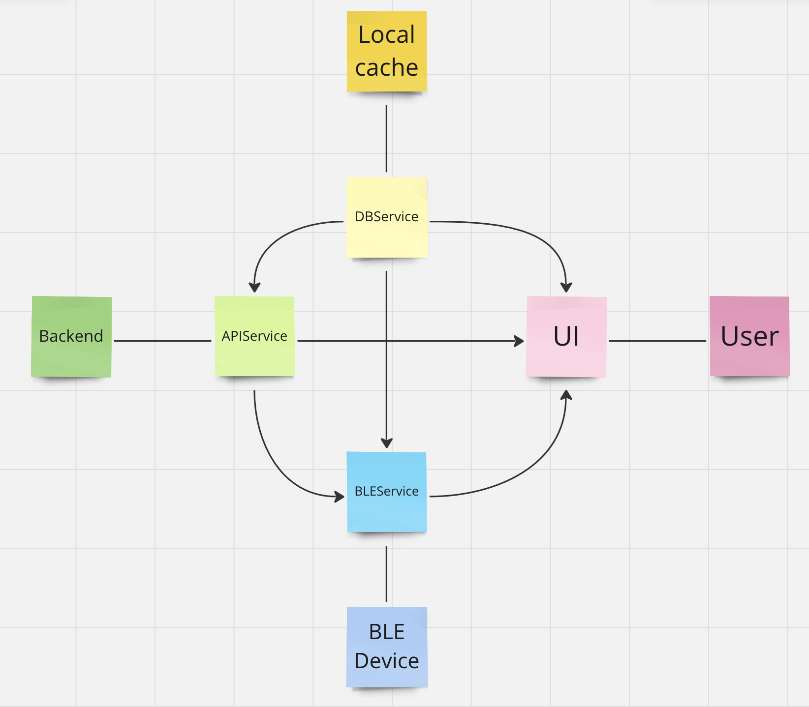

# Steps to Build Mobile App

This project is a mobile app built with React Native and Expo. As such, you must install [NodeJS](https://nodejs.org/en/download) for its package manager **npm** and **Expo**. Note if it says you do not have Expo in any of the steps below, you will need to install the Expo CLI by running `npm install -g eas-cli`. You may alternatively decide to use [yarn](https://classic.yarnpkg.com/lang/en/docs/install/#mac-stable) instead of npm, but it's recommended to install yarn through npm anyways.

## Versions

- Gradle: 7.0.2
- Java: 11.x

## Requirements

- [Node.js](https://nodejs.org)

## Development Setup (Android)

1. Install package dependencies with npm as specified in the package.json file with:

```
npm install
```

2. Plug your phone into your computer and create a dev build of the mobile app as specified in the app.json file by running:

```
npx expo run:android
```

3. You may notice a security exception, but this should not have impacted whether the development build has been installed on your phone. After the installation, start the development server which is necessary to run the development build by executing:

```
npm run start
```

4. Open the development build on your phone and either scan the QR Code or manually enter the URL that the development server indicates for you (e.g. http://192.168.0.15:8081).

*Note*: Any changes you make while the development server is running will automatically reload the app and apply the changes unless they are changes to the root component at index.js or other fundamental dependencies.

## Connecting Mobile App to Backend

Since we are using Expo version 48.0.0, support for environment variables is limited. As a result, our API connection information is stored directly in a Typescript file at src/utils/constants.ts. After deploying the backend, there are four constants in this file that you will need to change.

- BACKEND_ADMIN_URL: Change this to the URL of the admin/ endpoint.
- BACKEND_USER_URL: Change this to the URL of the user/ endpoint.
- BACKEND_USER_POOL_ID: Navigate to the Cognito service in your AWS management console where you will see a list of user pools. Change this constant's value to what is specified under the "User pool ID" column for the user pool beginning with "sickkids-pts-admin"
- BACKEND_USER_POOL_CLIENT_ID: Click on the user pool that we navigated to above, and then click on the *App Integration* tab. Scroll down until you see "App clients and analytics" where you should see an app client. Change this constant's value to what is specified under the "Client ID" column.

## Preview Build Setup Instructions

Preview builds are ways to test a production level build of an app without submitting it to app stores on iOS and Android.

1. Complete the instructions to setup a development build and connect the mobile app to the backend.
2. Create and login to an Expo account (see: https://docs.expo.dev/build/setup/)
3. For Android, run `eas build --profile preview --platform android`
   1. If the build is successful, after a while the CLI will return a QR code that will direct you to a link where you can install the APK on your Android phone. Alternatively, you can also input the url they provided into your phone's browser. The build should also be saved into your EAS account where you can access it anytime.
4. For iOS, run
    1. `npx expo install yarn --npm`
    1. `eas device:create` to add a device for ad hoc provisioning
    1. `eas build --profile preview --platform ios`

# Directory Structure

The entry point for the mobile app starts at index.js where it registers App.tsx as the root component. From there, all the React components found in the src/components and src/features folders are nested underneath this root. The files in the utils/ folder contain helper functions and constants that other files throughout the project depend on. Next, the context/ folder contains files responsible for providing a React Context of BLE-related and Authentication properties that various components need to display information, such as battery level, heart rate, device connectivity, admin sign-in status, etc.. Finally, the services/ folder contains files representing service interfaces that should be considered separate from the UI.

## Mobile App Architecture and Design

The key to understanding the mobile app architecture is to understand the relationship between the UI and services. Simply put, if the mobile app needs to interact with anything that is outside of itself like the backend (APIService), the BLE device (BLEService), and the local cache (DBService), it will interact with that thing through a service. Each of the three services act as an interface that provides the UI with functions it can call when it needs to interact with something external. It is also important to note that services can depend on one another as well, and specifically the BLE service relies on the API and DB service. Additionally, the APIService relies on the DBService.



Our design does not mean that the UI has a simple job (it is rather the opposite, the UI is the brain) as we have constructed each service to be as minimal and lightweight as possible. In other words, the functions in these service classes do the bare minimum and are designed for re-use, rather than catering to specific needs of the UI. Even the connectToDevice function in the BLEService class does the bare minimum for the purposes of our application. For example, it negotiates an MTU, writes the current time to the BLE device, and inserts/updates a cloudSyncInfo cache object. All of which are necessary for the optimal usage of the BLE device and are functionality that we would not expect the UI to invoke (e.g. the user will not have a button to negotiate MTU). In general, if you want to make a change to the API calls, interaction with the BLE device, or the local cache, you only need to look at the service files and the components where their functions are invoked.

There are two tables in the local cache as can be seen in the DBService file. One is for readings from the BLE device which is fairly self-explanatory. The other one cloud_sync_info is less intuitive, and is a table that contains all the properties needed for us to upload our readings to the backend. In an ideal situation where a study participant is only assigned a single device, this table should only have one row that will be updated each time the user uploads their readings to the cloud.

*Note*: For the local cache, we use an SQLite database installed locally on the smartphone. For authentication to AWS Cognito and API calls to the backend, we use the AWS Amplify library.

## BLE Data Transfer Protocol

We use a custom data transfer protocol to guarantee that the BLE device successfully transfers over its samples. You can look at the ble_data_transfer_protocol for a detailed description of the protocol the BLE device uses. In short, it is reservation-based (central has to initiate the transfer) and rate-based (peripheral transfers data at a faster rate upon receiving acknowledgements from central) protocol that uses acknowledgements. Also, the peripheral sends out fragments/chunks per BLE notification and central is responsible for reassembling them into samples.

### Terminology

If you read the code, you might wonder what is bleInterfaceId and how is it different from deviceId. We use bleInterfaceId to refer to the ID that react-native-ble-plx uses (MAC address on Android and UUID on iOS) to connect with the BLE device. We use deviceId to refer to the unique ID that is written on the device.
