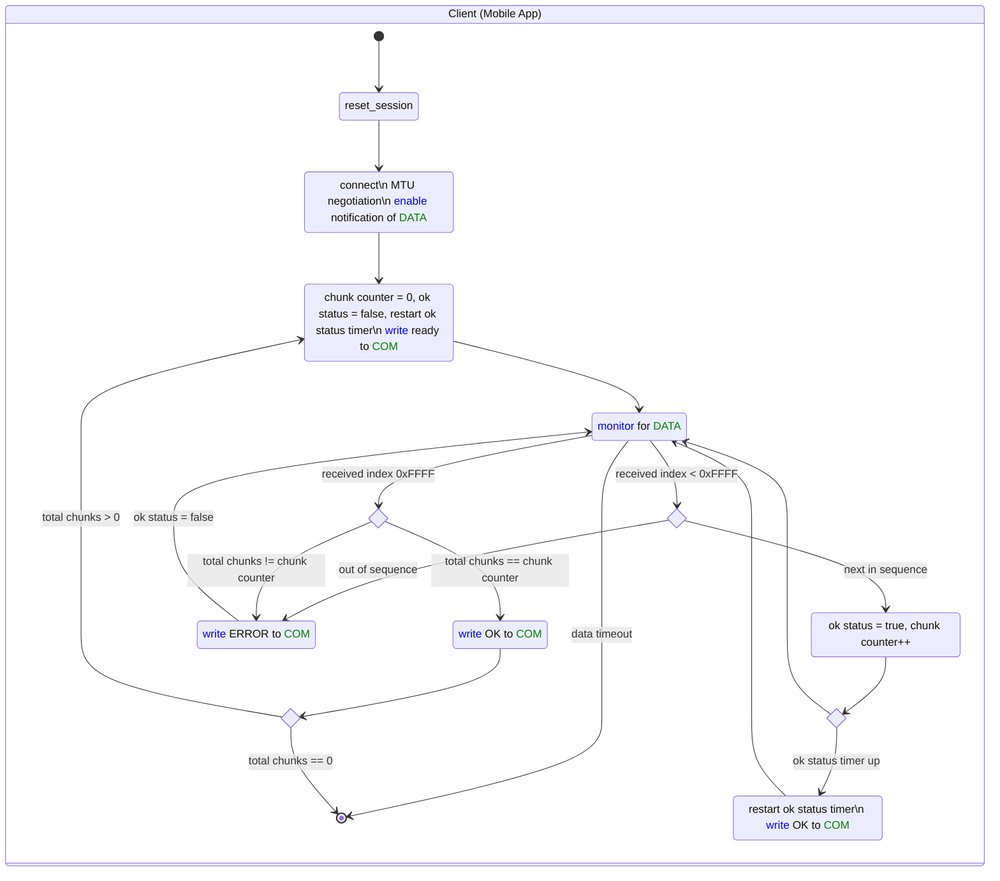

# BLE Protocol

## Service and Characteristic Definition

|                  | Long Name             | Short Name | UUID Type | UUID                                 | Value Length   | Length Characteristic | Characteristic Properties | Characteristic GATT Events    |
|------------------|-----------------------|------------|-----------|--------------------------------------|----------------|-----------------------|---------------------------|-------------------------------|
| Service 1        | Transfer_Service      | TS         | 128 bits  | 906404A1-F555-48F5-90AA-EA4A691B82DB |                |                       |                           |                               |
| Characteristic 1 | Status                | STATUS     | 128 bits  | 906404A2-F555-48F5-90AA-EA4A691B82DB | 20             | Constant              | Notify                    | Attribute write               |
| Characteristic 2 | Data_Communication    | COM        | 128 bits  | 906404A3-F555-48F5-90AA-EA4A691B82DB | 3              | Variable              | Write w/o resp            | Attribute write               |
| Characteristic 3 | Raw_Data              | DATA       | 128 bits  | 906404A4-F555-48F5-90AA-EA4A691B82DB | 244            | Variable              | Notify                    | Attribute write               |
|                  |                       |            |           |                                      |                |                       |                           |                               |
| Service 2        | Configuration_Service | CS         | 128 bits  | 920927B1-101E-442C-AA2D-3976829777BA |                |                       |                           |                               |
| Characteristic 1 | Current_Time          | TIME       | 128 bits  | 920927B2-101E-442C-AA2D-3976829777BA | 4              | Constant              | Read, Write w/o resp      | Attribute write, Read request |
| Characteristic 2 | Unique_Device_ID      | ID         | 128 bits  | 920927B3-101E-442C-AA2D-3976829777BA | 4              | Constant              | Read                      |                               |
| Characteristic 3 | API_Key               | KEY        | 128 bits  | 920927B4-101E-442C-AA2D-3976829777BA | 44             | Constant              | Read, Write w/o resp      | Attribute write               |
| Characteristic 4 | Reading_Interval      | RI         | 128 bits  | 920927B5-101E-442C-AA2D-3976829777BA | 2              | Constant              | Read, Write w/o resp      | Attribute write               |

STATUS is for basic information like battery level, charging, wearing, HR, etc.
TIME is the unix time [s] as a signed 32-bit integer
RI is an unsigned 16-bit integer [ms]

## Status Notification Format
Short BLE messages sent periodically

Currently:
| Name         | Description                | Units     | Byte Offset | Datatype | Example    |
|--------------|----------------------------|-----------|-------------|----------|------------|
| timestamp    | Unix time                  | s         | 0           | S32      | 1701018189 |
| touchSensor1 | Touch sensor 1 delta       |           | 4           | S8       | 26         |
| touchSensor2 | Touch sensor 2 delta       |           | 5           | S8       | -4         |
| soc          | Battery state of charge    | %         | 6           | U8       | 91         |
| isCharging   | Charger status             |           | 7           | U8       | 3          |
| heartRate    | Heartrate                  | bpm       | 8           | U8       | 87         |
||
| crate        | Rate of (dis)charge        | %/hour    | 9           | S8       | -4         |
| confidence   | Heartrate confidence level | %         | 10          | U8       | 50         |
| eda          | Electrodermal activity     | ADC count | 11          | U16      | 4000       |
| scd          | Skin contact detection     |           | 13          | U8       | 3          |
| activity     | Activity class             |           | 14          | U8       | 1          |
| reserved     | Reserved bytes             |           | 15          | 5 bytes  | 0          |

Each datatype indicates whether it is signed or unsigned and the number of bits. All datatypes are in big endian and signed integers are represented in two's complement.

## Raw Data Transfer Protocol

Example values: *ok status timeout* = 1s, *data timeout* = 10s

## Transfer Characteristic Format

#### COM characteristic
| Message Description                                                                                     | Byte 0         | Byte 1..2                                                           |
|---------------------------------------------------------------------------------------------------------|----------------|---------------------------------------------------------------------|
|                                                                                                         | *message type* |                                                                     |
| Ready to receive data                                                                                   | 0x00           |                                                                     |
| OK, proceed                                                                                             | 0x01           | last successfully received *chunk index*                            |
| ERROR (chunk out of sequence), restart sending chunk immediately after last successfully received chunk | 0x02           | last successfully received *chunk index* or 0xFFFF if none received |

*message type*: unsigned 8-bit integer

#### DATA characteristic
| Message Description                              | Byte 0..1      | Byte 2..3            | Byte 4..(N+1)            |
|--------------------------------------------------|----------------|----------------------|--------------------------|
| Data                                             | *chunk index*  | Chunk data byte 0..1 | Chunk data byte 2..(N-1) |
| Last message, also indicates *total chunks* sent | 0xFFFF         | *total chunks*       |                          |

*chunk index*: unsigned 16-bit integer (big-endian) with range [0,0xFFFE]

*total chunks*: unsigned 16-bit integer (big-endian) with a range of [0,0xFFFF], indicating total number of data chunks sent.

*N*: the length of the chunk. Note that this must be <= MTU (maximum transmission unit) - 3 (bytes of ATT overhead) - 2 (bytes of *chunk index*). According to the BLE specifications, the MTU default size is 23 bytes, corresponding to *N*=18.

# Data Sample Format
Each data sample consists of 170 bytes in total.

| Name       | Description                           | Units     | Byte Offset | Datatype | Example    |
|------------|---------------------------------------|-----------|-------------|----------|------------|
| timestamp  | Unix time                             | s         | 0           | S32      | 1699553827 |
| soc        | Battery state of charge               | %         | 4           | U8       | 91         |
| vcell      | ADC measurement of battery            | 20 mV     | 5           | U8       | 180        |
| crate      | Rate of (dis)charge                   | %/hour    | 6           | S8       | -4         |
| chgstat    | Charger status                        |           | 7           | U8       | 3          |
| touch[0]   | Touch sensor 1 delta                  |           | 8           | S16      | 6890       |
| touch[1]   | Touch sensor 2 delta                  |           | 10          | S16      | -890       |
| eda        | Electrodermal activity                | ADC count | 12          | U16      | 4000       |
| hr         | Heartrate                             | bpm       | 14          | U8       | 87         |
| confidence | Heartrate confidence level            | %         | 15          | U8       | 50         |
| scd        | Skin contact detection                |           | 16          | U8       | 3          |
| activity   | Activity class                        |           | 17          | U8       | 1          |
| reserved   | Reserved bytes                        |           | 18          | 2 bytes  | 0          |
|            | Acceleration (25 samples, 1s @ 25 Hz) |           |             |          |            |
| accelX[0]  |                                       | mg        | 20          | S16      | 283        |
| accelY[0]  |                                       | mg        | 22          | S16      | -15        |
| accelZ[0]  |                                       | mg        | 24          | S16      | 971        |
| accelX[1]  |                                       | mg        | 26          | S16      | 271        |
| accelY[1]  |                                       | mg        | 28          | S16      | -7         |
| accelZ[1]  |                                       | mg        | 30          | S16      | 982        |
|            | …                                     |           |             |          |            |
| accelX[24] |                                       | mg        | 164         | S16      | -102       |
| accelY[24] |                                       | mg        | 166         | S16      | -955       |
| accelZ[24] |                                       | mg        | 168         | S16      | -218       |

Each datatype indicates whether it is signed or unsigned and the number of bits. All datatypes are in big endian and signed integers are represented in two's complement.
