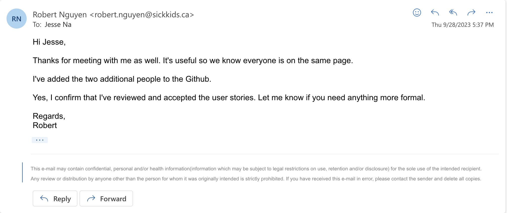

# TEAM VENUS (Project 43)

## Product Details

#### Q1: What is the product?

 * The product is primarily a mobile app that enables research studies into patient adherence to treatment plans using compression garments. The app essentially acts as a gateway between compression garments equipped with a sensor and the research database. Its purpose will be to provide the user with basic information about their medical device while also collecting sensor data from the device and forwarding it to the researchers. There is also a web application where the researchers can view and export the data into CSV format, and potentially make changes to parameters like the reading interval or questionnaire frequency.
 * We are working with The Thrombosis Program and The Wilfred and Joyce Posluns Centre for Image-Guided Innovation and Therapeutic Intervention (CIGITI), The Hospital for Sick Children for this project and we are planning on modifying their mobile app, web application, backend APIs, and database schemas to resolve the problems preventing the app from going live.
 * Compression garments are currently the only known treatment for managing Post-Thrombotic Syndrome (PTS), which can cause chronic pain, swelling, ulcers and other symptoms. So, researchers at Sick Kids want to develop strategies to increase patients' adherence to their treatment plan. The researchers at Sick Kids test the effectiveness of adherence strategies by measuring the difference between self-reported and actual hours of wear in studies conducted with voluntary participants. Four critical sub-problems must be addressed with the current iteration of the product to resolve this problem.
    1. Participants cannot see whether the medical device still has a battery charge or if it is connected to the mobile app, resulting in potential data loss. For example, if a participant wears the garment, goes outside for 2 hours and runs out of battery 1 hour in, they would have had no reasonable way of knowing this scenario could happen. If they did, they could've charged their sensor in advance. In the end, the example we've mentioned would result in the data showing the participant wore the garment for only 1 hour when this is not the case. Our solution will read the battery level from the compression garment and display it to the user. It will also do the same for Bluetooth connectivity status with the sensor and connectivity status with the backend API. We will also implement multiple measures to allow the user and researchers to know when sensor data is not transmitting to the database for whatever reason.
    2. The participants cannot conveniently self-report their number of hours wearing the medical device, and the researchers have no way of automatically providing and collecting these questionnaires. This problem poses a significant hurdle to the researchers' ability to acquire this information regularly (e.g. daily) for their study and compare it with participants' actual hours of wear. For instance, a participant currently would have to email, producing more work for the researchers keeping track of all these emails, or a participant could easily forget when they need to send in a self-report since there is no indicator in the mobile app or anywhere that they need to report in. Our solution will provide a page in the mobile app for users to fill in a questionnaire form that asks them to report their total hours wearing their compression garments for a given day. The app will take the submitted form, and forward it to our partner's database for storage. It will notify participants when a new questionnaire is available or send reminders. Our solution will also make changes to the web application and allow admins to configure the frequency of questionnaires.
    3. There is some rate-limiting issue with the mobile app during periods of high-frequency activity, resulting in data loss. For example, when the device is calibrated on the participant or during exercise, the sensors could send approximately 200 bytes/second for an hour and only a fraction would be received by the API and recorded in the database. Our solution aims to fix this issue, though it is immediately clear what it would take. We will need to do more investigation into this issue to see if it is an issue with the backend architecture or only the mobile app to provide a solution.
    4. Finally, accelerometer data from the medical device is not recorded in the database whatsoever, and our partner indicated they would like to have it for their study, but they are still unsure of how they will use this data. We will provide the researchers with this accelerometer data and record it in the database as part of participant readings.

Link to a Figma mockup of the mobile app: https://www.figma.com/file/daATs4Vw2jY6flE2iziOtE/frontendMockup?type=design&node-id=1-71&mode=design&t=pYtUnwRdSezXVKJQ-0

#### Q2: Who are your target users?

 * High school adolescents around the Greater Toronto Area (GTA) diagnosed with Post-Traumatic Stress (PTS) who are voluntarily participating in a study on compression garment adherence strategies. Since they have PTS, they are likely motivated to help the researchers in successfully conducting their study which may result in improvements to their treatment plans. They are responsible for wearing their garments according to their treatment plan and for self-reporting estimates of their hours of wear. They are expected to have basic smartphone skills and know how to navigate basic user interfaces. They will likely have busy schedules due to schoolwork, social relationships, and other activities, which may cause them to prioritize their other engagements over study commitments.
 * Children in elementary or middle school in the GTA diagnosed with PTS and their parents, who are voluntarily participating in a study on compression garment adherence strategies. Since the children have PTS and their parents care for them, they are both likely motivated to help the researchers in successfully conducting their study which may result in improvements to their treatment plans. Parents will be responsible for ensuring their children wear their garments according to their treatment plan and for reporting estimates of their children's hours of wear. Parents are expected to have basic smartphone skills and know how to navigate basic user interfaces. Parents are likely to have dedicated time for their child's medical needs and may be unavailable due to work for certain periods of the day.
 * Medical researchers at The Hospital for Sick Children (Sick Kids) who are dedicated to ensuring data accuracy and study validity. The goal of these researchers is to have an experimental system that allows them to test the effectiveness of adherence strategies for compression garments. Researchers are busy professionals with limited time, emphasizing the need for an efficient system that streamlines data collection and requires minimal training and resources to operate. They are generally comfortable with using web browsers and computers, and they prefer intuitive and user-friendly interfaces. They do not have the time to invest in learning new or complex UIs.

#### Q3: Why would your users choose your product? What are they using today to solve their problem/need?

   1. Our product will have a built-in self-report questionnaire that issues push notifications reminding participants to fill them in. As mentioned, self-reported hours of wear are necessary for the research study. These features will be helpful for younger children who rely on their parents and adolescents because both groups are busy with their lives and can easily forget when they need to fill out a questionnaire. Furthermore, without this built-in questionnaire, participants would have to email the researchers their reported hours of wear, further reducing the likelihood that they will do so reliably. Also, in this scenario, the researchers would not only be burdened with tedious administrative work (they would likely have to hire an intern) managing all of the questionnaire responses they receive, but this manual data entry is prone to human error. With our modifications, the researchers will also be able to configure the frequency of questionnaires so they can send more as needed for their study or less to conserve storage space in the database. Our solution will save the researchers valuable time and resources, and help ensure the data for their study is as valid as possible.
   2. Our product will allow users to see how much battery their device has left and whether it is connected to the mobile app and backend API. This feature is crucial in making a best-effort attempt to mitigate actual hours of wear data loss due to technical issues that are out of the scope of the research study. The participants cannot see this information right now because the medical device is too small for a display that shows Bluetooth connectivity or battery level, and the mobile app has not implemented this feature. Currently, participants would need to guess or charge their device preemptively, but this may not always be possible, or it may be too inconvenient for participants since they cannot use the device while it is charging. Moreover, the participants wouldn't even know whether the device is fully charged and ready to be worn again. Given that the participants voluntarily signed up for this study and are busy with other aspects of life, they want to be able to properly contribute, but with minimal hassle.
   3. Our solution will also fix the rate-limiting problem that plagues the current implementation preventing researchers from recording actual hours of wear data during periods of high-frequency activity. Fixing this issue is important because if sensor data is rate limited, then no new data can be received resulting in a significant amount of data loss (actual hours of wear could differ by hours in the worst case, minutes at best). Since the researchers care about the accuracy of the data and the validity of their study, they must limit the amount of extraneous technical problems to get a more precise measure of actual versus self-reported hours of wear.
   4. Finally, our product will forward accelerometer data providing researchers with more informative data that they can later use as another factor to determine the best adherence strategy. This particular addition was requested by the researchers directly.

   All of these changes will make it much easier for participants to participate in the research study and help the researchers better conduct their study on adherence to treatment plans using compression garments. The end goal will allow Sick Kids to formulate better strategies for adherence by comparing which strategy reduces the difference in self-reported and actual hours of wear, and apply the improved strategies to their clinical practice in treating PTS.

#### Q4: What are the user stories that make up the Minumum Viable Product (MVP)?

User stories here: https://balsam-tibia-afb.notion.site/68fcd49d45d347a7bd83b885a8302eca?v=f991b99c63d449a1a018e9b95402e37e

Partner acceptance evidence:

#### Q5: Have you decided on how you will build it? Share what you know now or tell us the options you are considering.

Technology Stack:
 * Our partner has imposed a hard line on the technology stack to be used for the mobile (React Native) and web applications (React). That said, we agree with their choice of technology stack and will briefly go over the reasoning. Our partner wants the mobile app to work on both Android and iOS, so developing with something like React Native makes this goal more convenient compared to developing for Android and iOS separately. However, the reason our partner chose React Native over Flutter is that React Native is quite similar in syntax and style to React, which could be used for web applications as well, so the development between the mobile and web applications would be more unified. Finally, the current iteration of the product was built with these two frameworks already and given that our team is also familiar with them, it only makes sense that we continue with them to save time and resources.
 * For the mobile app, we as a team have also decided to continue working off of what already exists as much as possible to save time and resources, so we've decided to use Expo (https://expo.dev/) as a development ecosystem since it has already been configured and set up. We've already been able to compile the code and run the development app on our phones and emulators. To connect the app with the Bluetooth Low Energy (BLE) sensor on the compression garment, we will continue to use the react-native-ble-plx library (https://github.com/dotintent/react-native-ble-plx) that has already been used to send participant heart rate and touch data to the backend.
 * Our partner already built the backend and database with AWS API Gateway and Lambda functions. See the attached diagram provided by our partner for a high-level view of how the mobile and web applications communicate with the backend and the backend's architecture. Most of our work will be on the mobile app side, so we don't have a good reason for overhauling this architecture unless necessary. Moreover, the backend functionality is simple and acts more as a data access layer (we don't process any of the medical sensor data we receive before storing it in the database), so it's another reason why we've decided to avoid changing the backend unless necessary. The only case in which we would change the architecture of the backend is if it is impossible to both use this serverless architecture and avoid the previously mentioned rate-limiting issue. We will need to do more investigation into this issue to see if it is an issue with the architecture or the mobile app to form a conclusion.
 * We will now provide a basic description of the architecture. When the mobile or web app wants to make an API call, it can leverage the Amplify library to send this call to the AWS API Gateway (possibly invoking Cognito for admin endpoints). There are three APIs these apps can call: Admin Management, Admin, and User. Note the user API is where the participant sensor data will be POSTed to. The Admin and User APIs can then perform CRUD operations on the RDS database (Postgres) that stores the active sensors, their readings, admin users, and participant information. The choice of a relational database here makes a lot of sense given the structured nature of the sensor readings, and we will work with their existing tables and schemas.
  * The platform is entirely self-contained, so there is no need for third party applications or APIs.

Image courtesy of Robert Nguyen @ Sick Kids

Deployment:
 * The backend is deployed using serverless (https://www.serverless.com/) with the help of AWS CloudFormation. Once again, this choice is largely guided by the fact that this process already exists in the repository we were provided. Nonetheless, given that the backend is serverless and leverages AWS API Gateway and Lambda, it is very convenient to leverage serverless to help us deploy as it supports this architecture. We will need to investigate further how our partner currently deploys the web and mobile applications to production, and once we find out, we will likely follow their process.

----
## Intellectual Property Confidentiality Agreement

We've agreed with our partner that we can share the software and code freely with anyone with or without a license, regardless of domain, for any use. This agreement is valid so long as we don't have access to sensitive information in our development repository.

----