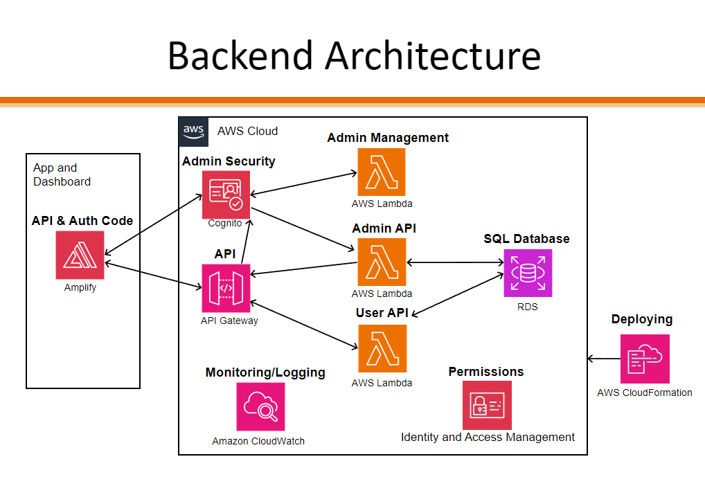

# TEAM VENUS (Project 43)

## Software Summary

#### What is the product and who is the partner?

* The product is primarily a mobile app that enables research studies into patient adherence to treatment plans using compression garments. The app essentially acts as a gateway between compression garments equipped with a sensor and the research database. Its purpose will be to provide the user with basic information about their medical device while also collecting sensor data from the device and forwarding it to the researchers. There is also a web application where the researchers can view and export the data into CSV format, and potentially make changes to parameters like the reading interval or questionnaire frequency.
* We are working with The Thrombosis Program and The Wilfred and Joyce Posluns Centre for Image-Guided Innovation and Therapeutic Intervention (CIGITI), The Hospital for Sick Children for this project and we are planning on modifying their mobile app, web application, backend APIs, and database schemas to resolve the problems preventing the app from going live.

#### What is the problem?

* Compression garments are currently the only known treatment for managing Post-Thrombotic Syndrome (PTS), which can cause chronic pain, swelling, ulcers and other symptoms. So, researchers at Sick Kids want to develop strategies to increase patients' adherence to their treatment plan. The researchers at Sick Kids test the effectiveness of adherence strategies by measuring the difference between self-reported and actual hours of wear in studies conducted with voluntary participants. Four critical sub-problems must be addressed with the current iteration of the product to resolve this problem.
    1. Participants cannot see whether the medical device still has a battery charge or if it is connected to the mobile app, resulting in potential data loss. For example, if a participant wears the garment, goes outside for 2 hours and runs out of battery 1 hour in, they would have had no reasonable way of knowing this scenario could happen. If they did, they could've charged their sensor in advance. In the end, the example we've mentioned would result in the data showing the participant wore the garment for only 1 hour when this is not the case. Our solution will read the battery level from the compression garment and display it to the user. It will also do the same for Bluetooth connectivity status with the sensor and connectivity status with the backend API. We will also implement multiple measures to allow the user and researchers to know when sensor data is not transmitting to the database for whatever reason.
    2. The participants cannot conveniently self-report their number of hours wearing the medical device, and the researchers have no way of automatically providing and collecting these questionnaires. This problem poses a significant hurdle to the researchers' ability to acquire this information regularly (e.g. daily) for their study and compare it with participants' actual hours of wear. For instance, a participant currently would have to email, producing more work for the researchers keeping track of all these emails, or a participant could easily forget when they need to send in a self-report since there is no indicator in the mobile app or anywhere that they need to report in. Our solution will provide a page in the mobile app for users to fill in a questionnaire form that asks them to report their total hours wearing their compression garments for a given day. The app will take the submitted form, and forward it to our partner's database for storage. It will notify participants when a new questionnaire is available or send reminders. Our solution will also make changes to the web application and allow admins to configure the frequency of questionnaires.
    3. There is some rate-limiting issue with the mobile app during periods of high-frequency activity, resulting in data loss. For example, when the device is calibrated on the participant or during exercise, the sensors could send approximately 200 bytes/second for an hour and only a fraction would be received by the API and recorded in the database. Our solution aims to fix this issue, though it is immediately clear what it would take. We will need to do more investigation into this issue to see if it is an issue with the backend architecture or only the mobile app to provide a solution.
    4. Finally, accelerometer data from the medical device is not recorded in the database whatsoever, and our partner indicated they would like to have it for their study, but they are still unsure of how they will use this data. We will provide the researchers with this accelerometer data and record it in the database as part of participant readings.

#### Existing software/infrastructure

There is a fair amount of existing software and infrastructure already.
 * There is an existing mobile app with a basic UI built in React Native and using Expo as a mobile development toolkit. The functionality to connect with the sensor device via Bluetooth is also implemented, but we will be re-doing this part as it is not reliable. The functionality to upload the sensor data to the database also exists.
 * Our partner has also already built the backend and database with AWS API Gateway and Lambda functions. See the attached diagram provided by our partner for a high-level view of how the mobile and web applications communicate with the backend and the backend's architecture. The backend functionality is simple and acts more as a data access layer (we don't process any of the medical sensor data we receive before storing it in the database), and the existing solution uses Serverless to deploy the API to AWS.
 * Finally, there is also a web application written in React which researchers can use to view and export sensor data. There is not much functionality besides this.

Image courtesy of Robert Nguyen @ Sick Kids

## Project Division

We've decided to divide the project into three distinct chunks based on business functionality. They consist of the web application, the user-facing aspects of the mobile app (e.g. notifications, self-report questionnaires, displaying battery level, etc.), and the hidden aspects of the mobile app (e.g. Bluetooth connectivity to the sensor device, API calls to upload data to cloud, caching sensor data on the client device, etc.). The reasoning behind this division was two-fold: an analysis of which parts of the existing solution had the most work put in (and that we could re-use) and the categorization of our user stories. As was mentioned previously, the backend acts more as a data access layer and so much of the existing solution can be re-used. We will now go more in depth on why this division yields the minimum amount of overlap between sub-teams by explaining the role of each component in the overall solution.

First, the web application does not directly interact with the mobile app and vice versa. It may indirectly interact with mobile but it would only do so through the backend. For example, the mobile app would get a property like the sensor data collection interval from an API endpoint and the web app can configure that interval via a different API endpoint. The backend would act as a middle man between the two. Since we have a few user stories specifically for the web application (e.g. viewing and exporting data into CSV format, configuring reading interval and questionnaire frequency, etc.) it is clear then how our choice to separate the web application as its own sub-team will minimize the amount of overlap.

Next, the reason we separated the mobile app into two teams, one managing the user-facing components and the other managing the hidden components is partly based on the number of user stories we have for each and the technical challenge of building a mobile app that must continuously monitor a Bluetooth device even while the app is in the background. The former is fairly self-explanatory, so we will focus on explaining the latter. The mobile app must continuously monitor (even in the background) the Bluetooth device because the sensor device is always emitting data that we want to capture. This background monitoring is a challenge because iOS and Android have different restrictions on what an app can do while in the background. In fact, iOS apps do not truly run in the background and instead are awakened when a connected Bluetooth device emits information. This context is important in understanding why we want to separate the Bluetooth and other components related to it (e.g. caching the sensor data in a SQLite database or making API calls to the backend with this data) because if these "hidden" components are heavily integrated with the user interface (UI), then it will make the code exceptionally messy and difficult to maintain. Note that currently, the existing solution has integrated the Bluetooth functionality with the UI and it is unsustainable. For example, in the existing solution, recursive calls are made to Bluetooth read operations within the UI and the existing code has struggled to avoid re-rendering the Bluetooth manager object responsible for interacting with the sensor device. Hence, we want to separate the mobile app into two teams, one managing the user-facing components and the other managing the hidden components. The former team will be able to make changes to the UI without worrying about breaking Bluetooth functionality and vice versa.

Note that all three sub-teams may likely still have to make modifications to the backend, but we have judged these modifications to be very minor. For example, adding a new column in a table (e.g. for accelerometer data) or creating a single API endpoint to fetch data in a different format. Hence, it made sense for us to divide the project along business functionality rather than the typical frontend/backend/database/deployment because the frontend portion would have a lot more work as can be seen from our user stories. A similar reason can be made for why we have no dedicated sub-team for testing (each sub-team is responsible for writing tests where they can), and that is because the vast majority of the solution we wish to provide can only be validated through end-to-end integration tests with the actual physical sensor device present. Writing unit tests or even integration tests by supplying dummy values in place of the sensor device would yield little benefit (i.e. we should not try and mock or stub the sensor device; in some cases it may not even be possible such as when we want to test if the sensor data is being forwarded while the app is running in the background).

Here are the teams assigned to each component:
* Sub team 43.1 will work on the hidden aspects of the mobile app
* Sub team 43.2 will work on the user-facing aspects of the mobile app
* Sub team 43.3 will work on the web application
